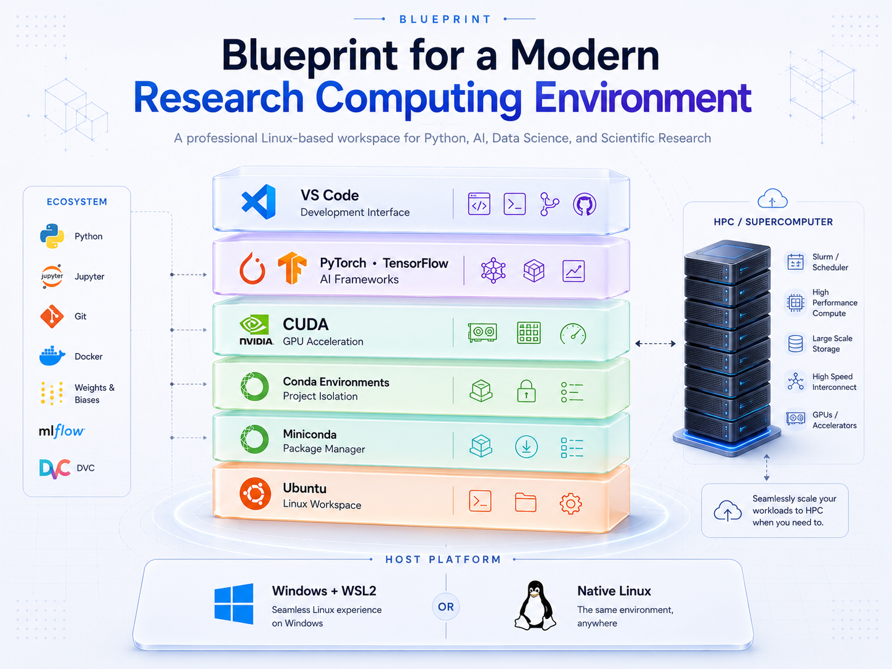

# Preface: Blueprint for a Modern Research Computing Environment
### A Practical Guide for Researchers and Scientists

Follow me :
<p align="left">
  <a href="https://www.linkedin.com/in/abhigyan-chakraborty/"
     target="_blank"
     rel="noopener noreferrer"
     title="LinkedIn">
    
  </a>
  &nbsp;&nbsp;
  <a href="https://abhigyan-pro.github.io/"
     target="_blank"
     rel="noopener noreferrer"
     title="Website">
    
  </a>
  &nbsp;&nbsp;
  <a href="https://abhigyan-pro.github.io/#blogs"
     target="_blank"
     rel="noopener noreferrer"
     title="Blogs">
    
  </a>
</p>



---

## Quick Summary

This series builds a complete research computing environment on Linux, using Python as the working language. It maps out the development stack we'll build across the series—Windows, WSL2, Ubuntu, Miniconda, Conda environments, and VS Code—and explains why each layer is there before we install any of it. 

By the end of this series, you won't just have Python installed. You will have a fully isolated, GPU-accelerated workbench capable of running complex deep learning models and preparing scripts for high-performance computing clusters. No installation happens in this article; that starts in Part 1.

---

## Objective

This preface orients you before you begin: why this series exists, what practical questions it answers that most tutorials skip, and how the series is organized part by part.

By the end of this blueprint, you'll know:
*   Why many Python developers work with Linux.
*   Why we're using WSL2 instead of replacing Windows.
*   Why we use Ubuntu, Miniconda, and VS Code.
*   How all these tools fit together.

> **We won't install anything yet.** That begins in the next article.

---

## Content

### Why This Series Exists

There are countless tutorials that show you how to install Python, WSL, Ubuntu, Miniconda, or VS Code. Many of them are excellent at helping you get started quickly.

However, as I learned Python and gradually moved into machine learning, scientific computing, and research, I often found myself asking practical questions that weren't always answered in one place. Questions like:

*   Why are we using WSL?
*   Why Ubuntu?
*   Why Miniconda instead of installing Python directly?
*   Where are my files actually stored?
*   Where should I keep my projects?
*   How do all these tools fit together?

None of these questions are particularly difficult, but the answers are often scattered across documentation, videos, blog posts, and discussions. Much of this understanding is something developers gradually build through experience.

This series is my attempt to bring those pieces together. Rather than simply showing commands to copy and paste, we'll build a modern Python development environment step by step while understanding the purpose of each tool and the workflow that connects them.

> **The goal is simple:**
> **Build a Python development environment that you understand — not just one that works.**

### Who This Is For

This series assumes **no prior programming or Linux experience**. We'll begin with the fundamentals and gradually build the skills needed for:
*   Python development
*   Data Science and Machine Learning
*   Scientific Computing and Research

### Why Not Just Install Python on Windows?

If you're learning Python, installing Python directly on Windows is perfectly reasonable. However, as you move into areas such as data science, machine learning, artificial intelligence, scientific computing, research, or software development, you'll notice something.

Many tutorials, development tools, cloud platforms, and research environments assume you're working in Linux. That doesn't mean Windows is a bad choice. Instead, we'll keep Windows while gradually learning Linux using WSL2.

### The Development Stack

By the end of this series, your setup will look like this:

```text
Windows 11 (Primary OS)
├── VS Code
│   └── Connects seamlessly to Linux via the Remote-WSL extension
└── WSL2 (Windows Subsystem for Linux)
    └── Ubuntu (Linux Operating System)
        └── Miniconda (Package & Environment Manager)
            └── Conda Environments (Isolated project workspaces)
                └── Python & Packages (The Engine)
```

Each layer has a different responsibility. Let's understand them one by one.

*   **Windows:** Windows remains your primary operating system. You'll continue using File Explorer, Web browsers, Microsoft Office, and VS Code. Nothing changes here.
*   **WSL2:** Windows Subsystem for Linux (WSL2) lets Linux run directly inside Windows. Many Python development tools and servers use Linux. WSL2 allows us to learn and use Linux without replacing Windows or setting up a dual-boot system.
*   **Ubuntu:** Ubuntu is the Linux operating system we'll install inside WSL2. It's one of the most widely used Linux distributions and has excellent documentation and community support. Many tutorials also assume Ubuntu.
*   **Miniconda:** Miniconda provides Python and Conda. Different projects often require different versions of Python and different packages. Miniconda makes managing these environments straightforward.
*   **Conda Environments:** Instead of installing everything into one Python installation, each project gets its own isolated environment. This keeps projects independent and reproducible. 
*   **VS Code:** VS Code is the editor we'll use throughout this series. Although VS Code runs on Windows, it can connect directly to Ubuntu through WSL. This gives us the convenience of a graphical editor while running our code inside Linux.

### Putting It All Together

The workflow we'll build looks like this:

```text
Ubuntu Terminal
       │
       ▼
Project Directory
       │
       ▼
Conda Environment
       │
       ▼
VS Code (Remote - WSL)
       │
       ▼
Develop & Execute Python Code
```

Each component has a specific purpose. Together, they create a development environment that is widely used in software development, data science, machine learning, and scientific research.

---

<details markdown="1">
  <summary>
  <strong>💡 Getting Unstuck (Expand for AI Troubleshooting Prompts)</strong>
  </summary>
  
  AI tools (like Claude, Grok, Gemini, or ChatGPT) give the best troubleshooting advice when they have the exact text of the tutorial. To ensure the AI understands what you are trying to build, we will give it the actual file.

  **1. Download the tutorial file**
  * Open this link in a new tab: [Preface.md on GitHub](https://github.com/abhigyan-pro/abhigyan-pro.github.io/blob/main/Blogs/Preface.md)
  * Look near the top-right corner of the text box on that page.
  * Click the **Download raw file** button (it looks like a downward arrow ⬇️).

  **2. Upload it to your AI**
  * Open your AI tool (ChatGPT, Claude, Gemini, etc.).
  * Click the **paperclip (📎)** or **plus (➕)** icon next to the text box to upload the file (or simply drag and drop `Preface.md` into the chat).

  **3. Ask for Help**
  Copy and paste this exact prompt into the chat along with your file:

  > I have attached the markdown file for the tutorial I am following. Please read it so you understand the specific environment I am trying to build.
  >
  > I need help with the following:
  >
  > **Step [X]:** [paste exact step text from the blog]
  >
  > **Command I ran:** [paste exact command]
  >
  > **What happened:** [paste full output/error — if the terminal was truly blank, say so explicitly]
  >
  > Please help me troubleshoot and fix this error. You can use your general knowledge to solve the problem, but your solution MUST align with the architecture and tools taught in the attached file. Do not suggest alternative setups that contradict the tutorial. Once fixed, tell me what to do next in the article.

  **To go deeper on a step before you run a command:**

  > I have attached the `Preface.md` file. Look at Step [X] and explain exactly what the command does and why we are doing it before I run it.

  Think of this series as the roadmap and your AI assistant as your learning companion.

</details>

---

### Series Roadmap

Here is how our journey is structured. Each article has a single objective, allowing you to learn one concept at a time without feeling overwhelmed.

**Phase 1: The Local Workbench (Foundations)**
*   **Preface:** Blueprint for a Modern Research Computing Environment *(You are here)*
*   **Part 1:** Installing WSL2 with Ubuntu, and Miniconda
*   **Part 2:** Terminal Basics and File Navigation
*   **Part 3:** Managing Projects with Conda Environments
*   **Part 4:** Setting Up VS Code

**Phase 2: The Research Infrastructure (Scale & Organization)**
*   **Part 5:** Linux Essentials for HPC and Remote Servers
*   **Part 6:** Git and GitHub for Reproducible Research
*   **Part 7:** Project Organization and Managing Scientific Data

**Phase 3: High-Performance Computing (Machine Learning)**
*   **Part 8:** Enabling GPU Computing in WSL and Linux with CUDA
*   **Part 9:** Installing PyTorch and TensorFlow for Deep Learning

**Phase 4: Open Science (Sharing & Reproducibility)**
*   **Part 10:** Building Reproducible Research Workflows
*   **Part 11:** Contributing to Open Science

---

## What's Next

Now that you understand the overall development stack, it's time to build it.

In the next article, we'll install WSL2, Ubuntu, and Miniconda, and verify that everything is working correctly before moving on.

**Next:** [Part 1 — Installing WSL2 with Ubuntu, and Miniconda](https://abhigyan-pro.github.io/Blogs/Part1.html)

[All Blogs](https://abhigyan-pro.github.io/#blogs)

---
*Happy learning!*